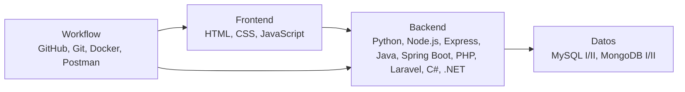

  

# Kevin Lopez

**Full Stack Developer Junior**  
Guatemala, Guatemala | Remoto / Hibrido

## Arquitectura de perfil

Desarrollo soluciones web de aprendizaje con frontend, backend, bases de datos y control de versiones. Me enfoco en entender el problema, estructurar el proyecto y documentar el resultado.

## Stack visual

  

## Proyectos como soluciones

| Solucion | Contexto | Stack | Enlace |
|---|---|---|---|
| control-inventario | Productos, movimientos y reportes. | Laravel, MySQL | [Ver](https://github.com/kevin-lopez-dev/control-inventario) |
| api-reservas | Reservas y disponibilidad de espacios. | Node.js, Express, MongoDB | [Ver](https://github.com/kevin-lopez-dev/api-reservas) |
| crud-dotnet | CRUD con estructura empresarial. | C#, .NET, MySQL | [Ver](https://github.com/kevin-lopez-dev/crud-dotnet) |

## Graficos de actividad

  
  

## Contacto

**LinkedIn:** https://linkedin.com/in/kevin-lopez-dev  
**GitHub:** https://github.com/kevin-lopez-dev  
**Correo:** kevin.lopez@email.com

