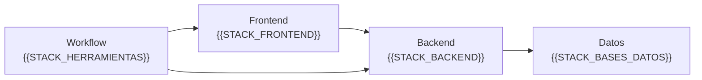

  

# {{NOMBRE_COMPLETO}}

**{{ROL_OBJETIVO}}**  
{{UBICACION}} | {{DISPONIBILIDAD}}

## Arquitectura de perfil

{{RESUMEN_PROFESIONAL}}

## Stack visual

  

## Proyectos como soluciones

| Solucion | Contexto | Stack | Enlace |
|---|---|---|---|
| {{PROYECTO_1_NOMBRE}} | {{PROYECTO_1_DESCRIPCION}} | {{PROYECTO_1_TECNOLOGIAS}} | [Ver]({{PROYECTO_1_URL}}) |
| {{PROYECTO_2_NOMBRE}} | {{PROYECTO_2_DESCRIPCION}} | {{PROYECTO_2_TECNOLOGIAS}} | [Ver]({{PROYECTO_2_URL}}) |
| {{PROYECTO_3_NOMBRE}} | {{PROYECTO_3_DESCRIPCION}} | {{PROYECTO_3_TECNOLOGIAS}} | [Ver]({{PROYECTO_3_URL}}) |

## Graficos de actividad

  
  

## Forma de aportar

| Principio | Aplicacion |
|---|---|
| Analisis | {{PROPUESTA_VALOR_1}} |
| Orden | {{PROPUESTA_VALOR_2}} |
| Construccion | {{PROPUESTA_VALOR_3}} |
| Validacion | {{PROPUESTA_VALOR_4}} |
| Mejora | {{PROPUESTA_VALOR_5}} |

## Objetivo profesional

{{OBJETIVO_PROFESIONAL}}

**Contacto:** [LinkedIn]({{LINKEDIN}}) | [GitHub](https://github.com/{{USUARIO_GITHUB}}) | {{CORREO_PROFESIONAL}}

